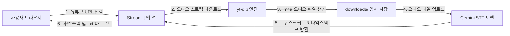

# 유튜브 오디오 다운로드 및 Gemini STT 트랜스크립트 추출 웹 서비스 구축 계획

## 1. 개요
유튜브 영상 URL을 입력하면 해당 영상의 오디오 스트림을 추출/다운로드하고, Google Gemini API의 최신 음성 인식 모델(`gemini-3.5-transcribe` / `gemini-2.5-flash`)을 활용하여 고품질의 한국어/다국어 텍스트 트랜스크립트를 생성하는 웹 서비스를 구축합니다.

---

## 2. 기술 스택 및 아키텍처



- **프론트엔드 & 웹 프레임워크**: `Streamlit`
  - 유튜브 영상 임베딩/미리보기, 오디오 플레이어, 트랜스크립트 실시간 표시, 텍스트 다운로드 버튼 내장
- **오디오 다운로더**: `yt-dlp`
  - FFmpeg 없이도 네이티브 m4a/aac 고음질 오디오 스트림 직접 다운로드 가능 (의존성 최소화)
- **STT 전사 엔진**: `google-genai` SDK
  - 모델: `gemini-3.5-transcribe` (화자 분리 및 단어 타임스탬프 지원) 또는 `gemini-2.5-flash`
  - 대용량 오디오도 안정적으로 처리할 수 있도록 `client.files.upload` (File API) 지원
- **환경 관리**: `python-dotenv` (기존 `.env`의 `GEMINI_API_KEY` 자동 재활용)

---

## 3. 주요 기능 및 UI 설계

1. **입력 섹션**:
   - 유튜브 URL 입력 필드 (유효성 검사 지원)
   - 모델 선택 옵션 (`gemini-3.5-transcribe`, `gemini-2.5-flash`)
   - 타임스탬프/화자 분리 활성화 토글 스위치
2. **미디어 재생 섹션**:
   - 입력된 유튜브 영상 미리보기
   - 추출된 오디오 실시간 웹 플레이어 (`st.audio`)
3. **트랜스크립트 결과 섹션**:
   - 변환된 텍스트 실시간 렌더링
   - 타임스탬프별 대화 블록 시각화
   - 결과를 텍스트 파일(`.txt`)로 바로 저장할 수 있는 다운로드 버튼

---

## 4. 제안하는 파일 구조

새로운 서브 디렉터리 `youtube-stt-service/` 내에 모듈화하여 구성합니다:

```
e:\GoogleAiStudio-Tutorial\
└── youtube-stt-service/
    ├── app.py              # Streamlit 메인 웹 애플리케이션
    ├── downloader.py       # yt-dlp 기반 유튜브 오디오 다운로더 모듈
    ├── transcriber.py      # Gemini STT (Google GenAI) 연동 모듈
    ├── requirements.txt    # 필요 패키지 목록 (yt-dlp, streamlit, 등)
    └── README.md           # 웹 서비스 실행 방법 및 상세 가이드
```

---

## 5. 단계별 실행 계획

### 단계 1: 의존성 패키지 설치
- `yt-dlp` 및 `streamlit` 패키지를 현재 conda 가상환경(`myenv`)에 설치

### 단계 2: 백엔드 모듈 구현
1. `downloader.py`: 유튜브 URL로부터 영상 메타데이터(제목, 썸네일, 길이) 조회 및 `.m4a` 오디오 파일 다운로드 함수 구현
2. `transcriber.py`: 오디오 파일을 Gemini File API로 업로드하고 STT 전사 및 타임스탬프 텍스트를 추출하는 함수 구현

### 단계 3: Streamlit 웹 애플리케이션(`app.py`) 구현
- 세련된 레이아웃(헤더, 사이드바 설정, 진행률 스피너, 오디오 재생기, 트랜스크립트 뷰어) 구현

### 단계 4: 검증 및 테스트
- 실제 유튜브 영상 링크(짧은 영상 예시)를 입력하여 다운로드 및 STT 텍스트 변환 엔드투엔드 테스트 실행

---

## 6. 확인 및 질문 (User Review)

> [!NOTE]
> `Streamlit` 기반 웹 서비스는 직관적인 대시보드와 오디오 재생기를 기본 제공하여 사용하기 가장 편리합니다. 만약 FastAPI 기반의 별도 웹페이지(HTML/JS) 형태를 선호하신다면 말씀해주세요.

이 계획대로 진행해도 괜찮으실까요? 승인해주시면 즉시 구축을 시작하겠습니다.
